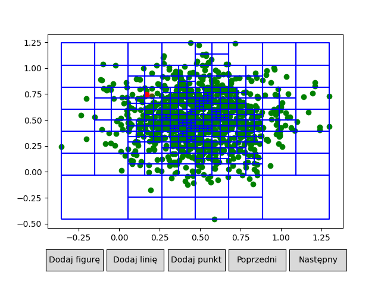
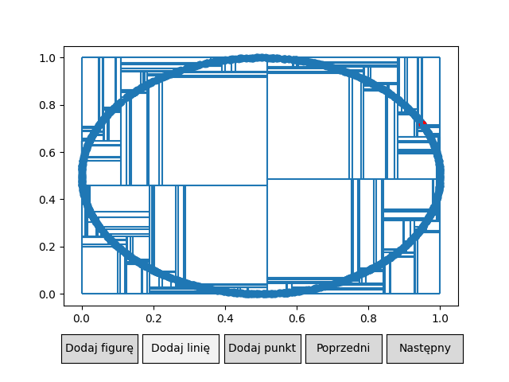

# What is this?
This repository contains all the code writen for the **Geometric algorithms** course at AGH UST including both the laboratories and the final project.
The technical documentation for the final project can be found [here](project/documents/documentation.pdf)

# What was implemented?
Folders lab1 and lab2 contain simple implementation of jarvis and graham scans and also a study of tolerances and determinant functions in classifying points on a 2D plane.

The final project contains an implementation and visualisation of **QuadTree** as well as and implementaion and visualisation of **KD-Tree**.

# Authors 
* [Wojciech Łoboda](https://github.com/wojciechloboda)
* [Krzysztof Pęczek](https://github.com/out-somniac)